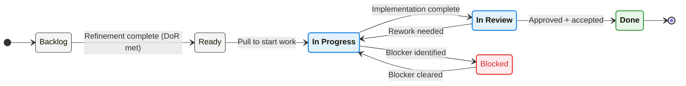

# Jira Workflow Standards

## Purpose
Standardize workflows so tracking data is reliable, comparable across teams, and usable for decision-making.

## Standard status definitions
- **Backlog**: approved work, not yet committed to a sprint/cycle
- **Ready**: meets Definition of Ready (DoR) and can be pulled
- **In Progress**: actively being worked
- **Blocked**: progress stopped; blocker recorded with owner + ETA
- **In Review**: awaiting review/approval
- **Done**: meets Definition of Done (DoD) and is shipped/accepted

# Jira Workflow Standards

## Purpose
Standardize workflows so tracking data is reliable, comparable across teams, and usable for decision-making.

## Standard status definitions
- **Backlog**: approved work, not yet committed to a sprint/cycle
- **Ready**: meets Definition of Ready (DoR) and can be pulled
- **In Progress**: actively being worked
- **Blocked**: progress stopped; blocker recorded with owner + ETA
- **In Review**: awaiting review/approval
- **Done**: meets Definition of Done (DoD) and is shipped/accepted

## Workflow (visual)

## Definition of Ready (DoR)
Ticket must include:
- Clear problem statement and expected outcome
- DRI (owner) and target window
- Dependencies documented (if any)
- Acceptance criteria and/or success metric
- Link to relevant spec or note (if needed)

## Definition of Done (DoD)
- Acceptance criteria met
- Stakeholders notified (as applicable)
- Links to docs/runbooks updated
- Post-implementation notes recorded (if applicable)

## Operating rules
- No ticket stays **In Progress** without an update for **7+ days**.
- An “update” means a meaningful note on progress/next action (not just a status toggle).
- **Blocked** tickets must include: blocker type, owner, next action, ETA.
- Teams use the same required fields (see taxonomy).
- Status changes are meaningful: do not use statuses to “look green.”

---

## Example (filled): Workflow policy for Stories/Tasks (practical)

### Issue types (lightweight model)
- **Epic:** outcome-level initiative spanning multiple stories; has milestones and success metric.
- **Story/Task:** deliverable unit that can be completed within a sprint/cycle; has DoR/DoD.
- **Bug:** defect with severity and customer impact; may bypass normal prioritization when Sev1/Sev2.

### Required fields by status (guardrails)
| Status | Required fields (minimum) | Exit criteria |
|---|---|---|
| Backlog | Program/Domain, stakeholder, priority | Ready for refinement |
| Ready | DRI, acceptance criteria, dependencies linked (if any), target window | Meets DoR |
| In Progress | DRI, last update date, next action | Updated within 7 days |
| Blocked | blocker type, owner, next action, ETA | Blocker resolved or escalated |
| In Review | reviewer assigned, PR/spec link | Review completed |
| Done | acceptance criteria met, links to artifacts (doc/runbook/decision) | Stakeholder acceptance |

### SLA defaults (simple)
- **In Progress update SLA:** update at least every **7 days** (otherwise move back to Ready/Backlog).
- **PR/review SLA (critical path):** initial review within **24–48 hours**.
- **Blocked escalation:** if ETA is within **10 business days** of need and unresolved, escalate with a crisp ask.

